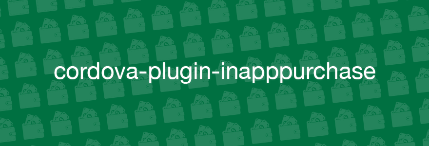

# cordova-plugin-inapppurchase



A lightweight cordova plugin for in app purchases on iOS/Android.

Features:

- Simple, promise-based API
- Support for consumable/non-consumable products and paid/free subscriptions
- Support for restoring purchases
- Uses well tested native libraries internally - [RMStore](https://github.com/robotmedia/RMStore) for iOS and an adjusted  [com.google.payments](https://github.com/MobileChromeApps/cordova-plugin-google-payments/tree/master/src/android) for Android

## Install

    $ cordova plugin add cordova-plugin-inapppurchase

## Configuration

### iOS

No configuration is necessary.

### Android

You must create a ```manifest.json``` in your project's ```www``` folder with your Android Billing Key:

    { "play_store_key": "<Base64-encoded public key from the Google Play Store>" }

You can get this key from the Google Play Store (under "Services & APIs") after uploading your app.

## API

All functions return a Promise

### #getProducts()

Retrieves a list of full product data from Apple/Google. This method must be called before any purchases are attempted.

***inAppPurchase.getProducts(productIds)***

- ___productIds___ - an array of product ids

If successful, the promise resolves to an array of objects. Every object has the following attributes:

- productId - SKU / product bundle id (such as 'com.yourapp.prod1')
- title - short localized title
- description - long localized description
- price - localized price

___Example:___

```js
  inAppPurchase
    .getProducts(['com.yourapp.prod1', 'com.yourapp.prod2', ...])
    .then(function (products) {
      console.log(products);
      /*
         [{ productId: 'com.yourapp.prod1', 'title': '...', description: '...', price: '...' }, ...]
      */
    })
    .catch(function (err) {
      console.log(err);
    });
```

### #buy()

***inAppPurchase.buy(productId)***

- ___productId___ - a string of the productId

If successful, the promise resolves to an object with the following attributes:

- productId
- transactionId - the transaction/order id
- receipt - on iOS it will be the base64 string of the receipt, on Android it will be ...

Example:

```js
  inAppPurchase
    .buy('com.yourapp.prod1')
    .then(function (data) {
      console.log(data);
      /*
        {
          productId: ...
          transactionId: ...
          receipt: ...
        }
      */
    })
    .catch(function (err) {
      console.log(err);
    });
```

### #consume()

***inAppPurchase.consume(receipt)***

- ___receipt___ - a string of the receipt (Android's purchase token) from the response of the buy() function above

Call this function after purchasing a "consumable" product to mark it as consumed.

NOTE: This function is only relevant to Android purchases.

On ***Android***, you must consume products of type CONSUMABLE. If you will not consume the product after a purchase, next time you will attempt to purchase this product you will get the error message:
```"{"code":-9,"message":"Item already owned","text":"Unable to buy item (response: 7:Item Already Owned)","response":7}"```

On ***iOS*** there is no need to "consume" a product. However, in order to make your code cross platform, it is recommended to call it for iOS purchases as well.

Example:

```js
  // fist buy the product...
  inAppPurchase
    .buy('com.yourapp.consumable_prod1')
    .then(function (data) {
      // ...then mark it as consumed:
      return inAppPurchase.consume(data.receipt);
    })
    .then(function (data) {
      console.log('product was successfully consumed!');
    })
    .catch(function (err) {
      console.log(err);
    });
```

### #restorePurchases()

***inAppPurchase.restorePurchases()***

If successful, the promise resolves to an object with the following attributes:

- productId
- state - the state of the product (ACTIVE, CANCELLED or REFUNDED)
- date - timestamp of the purchase
- transactionId - (iOS only)
- packageName - (Android only) the package name / bundle id of your app (such as 'com.yourcompany.yourapp')

Example:

```js
  inAppPurchase
    .restorePurchases()
    .then(function (data) {
      console.log(data);
      /*
        {
          transactionId: ...
          productId: ...
          state: ...
          date: ...
        }
      */
    })
    .catch(function (err) {
      console.log(err);
    });
```

## Developing

### build:

    $ gulp watch

### run tests:

    $ npm test

## License

The MIT License

Alex Disler (alexdisler@gmail.com) 2016

Permission is hereby granted, free of charge, to any person obtaining a copy of this software and associated documentation files (the "Software"), to deal in the Software without restriction, including without limitation the rights to use, copy, modify, merge, publish, distribute, sublicense, and/or sell copies of the Software, and to permit persons to whom the Software is furnished to do so, subject to the following conditions:

The above copyright notice and this permission notice shall be included in all copies or substantial portions of the Software.

THE SOFTWARE IS PROVIDED "AS IS", WITHOUT WARRANTY OF ANY KIND, EXPRESS OR IMPLIED, INCLUDING BUT NOT LIMITED TO THE WARRANTIES OF MERCHANTABILITY, FITNESS FOR A PARTICULAR PURPOSE AND NONINFRINGEMENT. IN NO EVENT SHALL THE AUTHORS OR COPYRIGHT HOLDERS BE LIABLE FOR ANY CLAIM, DAMAGES OR OTHER LIABILITY, WHETHER IN AN ACTION OF CONTRACT, TORT OR OTHERWISE, ARISING FROM, OUT OF OR IN CONNECTION WITH THE SOFTWARE OR THE USE OR OTHER DEALINGS IN THE SOFTWARE.
